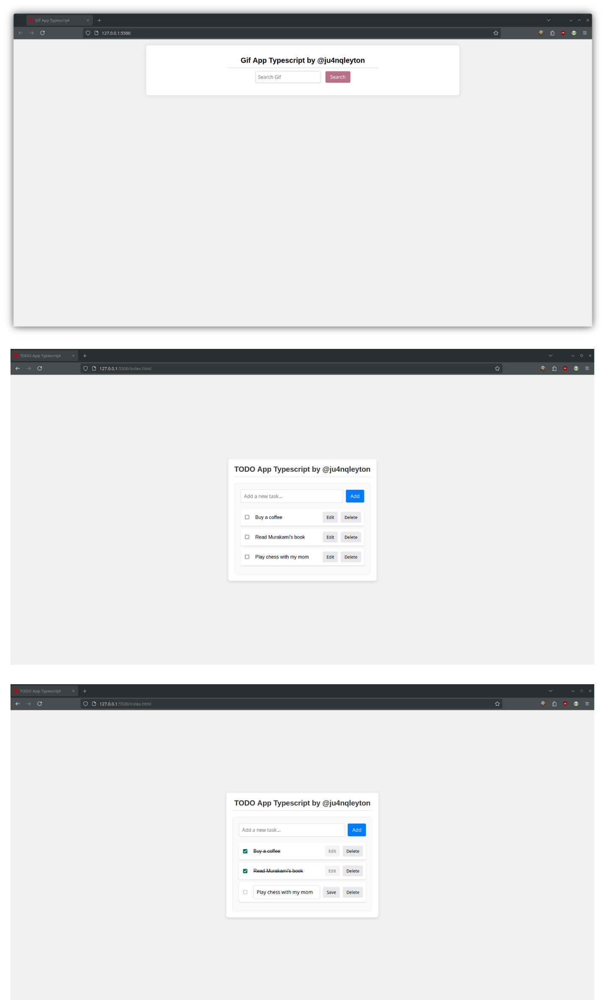

# TODO App TypeScript

Esta es una aplicación sencilla de lista de tareas (TODO) desarrollada con TypeScript y JavaScript sin dependencias ni librerías externas.

## Características

- Añadir nuevas tareas.
- Marcar tareas como completadas.
- Editar tareas.
- Eliminar tareas.
- Validación para evitar editar tareas completadas.

## Requisitos

- Node.js
- TypeScript

## Capturas de Pantalla

